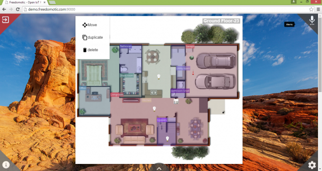

Freedomotic Polymer Web Client
==============================

This is a simple frontend web application that interacts with a Freedomotic 5.6.0 instance via its REST API V3.

Demo parameters (TO SET AT LOGIN)  
 * address: demo.freedomotic.com (NO REQUIRED)
 * username: admin
 * password: admin
 * SSL: no

`Go to the Demo >>> <http://demo.freedomotic.com:8090/>`_

.. image:: images/webapp1.png
    :width: 650px
    :align: center
    :height: 400px
    :alt: Freedomotic Polymer Web client
  
    
.. image:: images/webapp2.png
    :width: 650px
    :align: center
    :height: 400px
    :alt: Freedomotic Polymer Web client
    
    
.. image:: images/webapp3.png
    :width: 650px
    :align: center
    :height: 400px
    :alt: Freedomotic Polymer Web client
    
    
