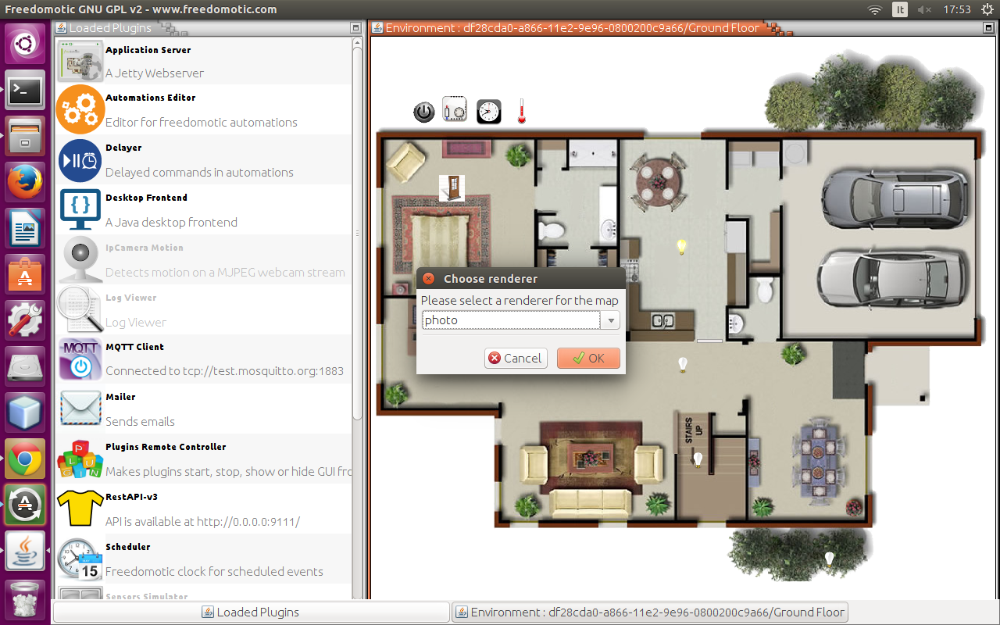
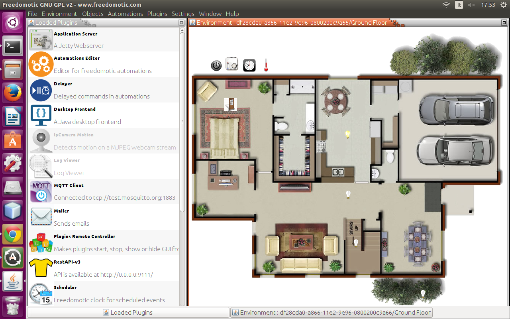
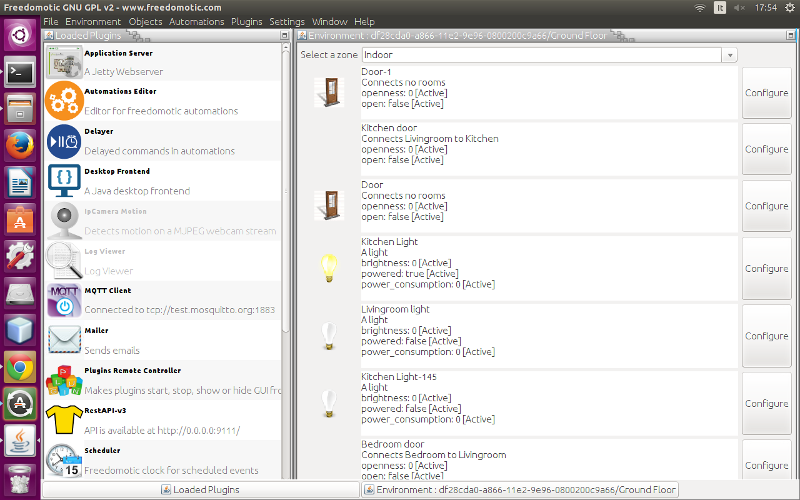
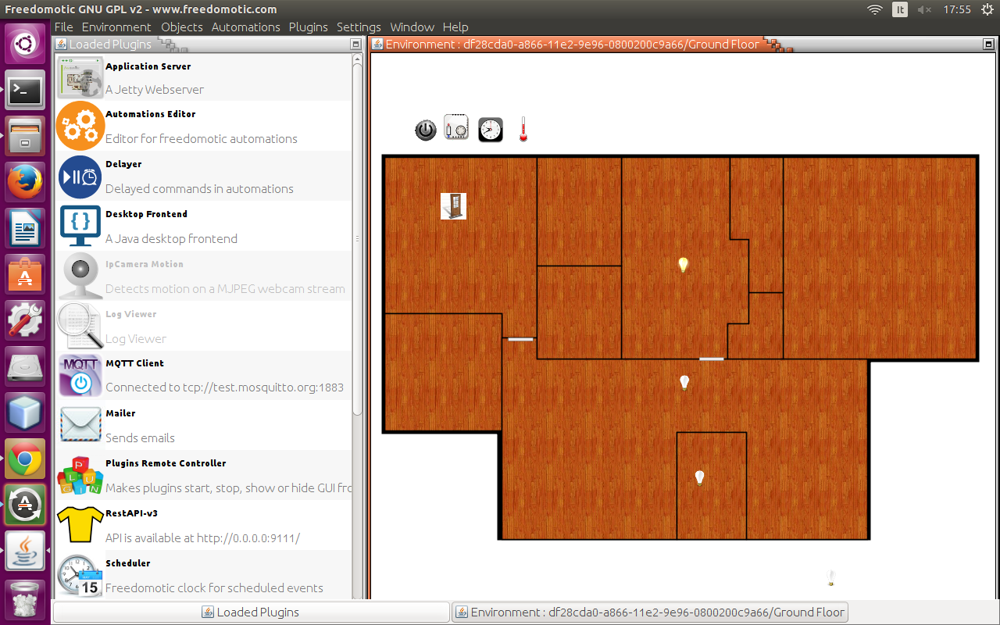
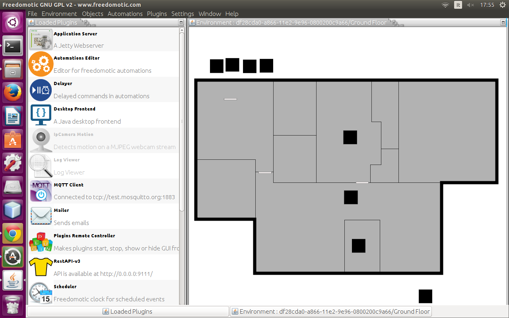
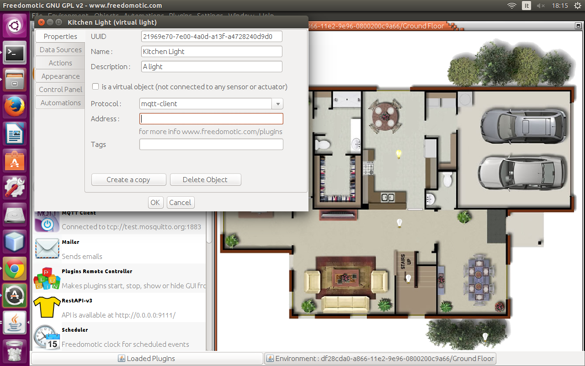
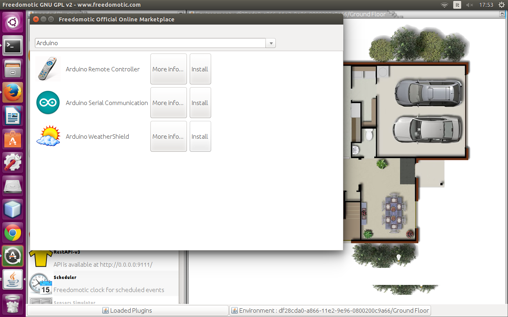
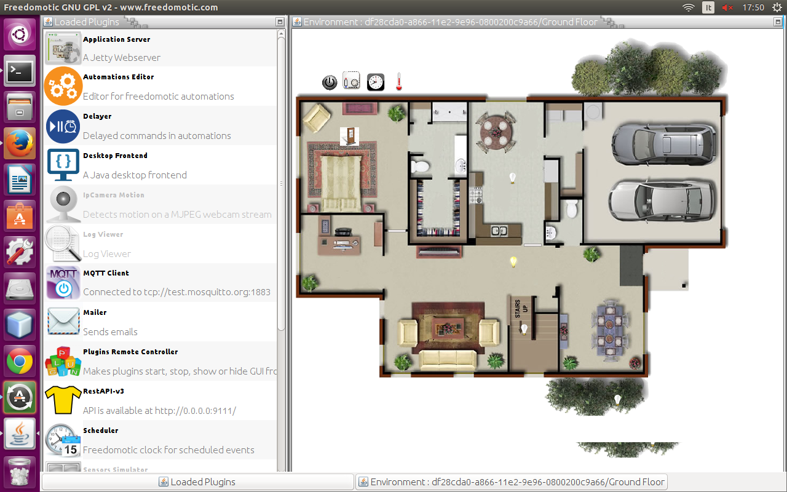

Jfrontend
=========

Environments
############

Change renderer
***************
This frontend supports different renderers.

    
    Change renderer
    

    
    Photo renderer

    
    List renderer

    
    Image renderer

    
    Plain renderer
    
    

Change background images
************************
Go to menu **Edit** -> **Environment** -> **Change Background** and select a PNG or JPG file.

Add a new room
**************
To add a new room click on menu **Edit** -> **Room Edit Mode (F5)** and then **Edit** -> **Environment** -> **Add Room**.
A new square polygon is created on the left top corner of the environment.  Now you can drag the blue handles to position the room correctly on the map. 

Rename a room
*************
To rename a room click on **Edit** -> **Environment** -> **Rename Room** and digit the new name into the dialog box. 

Delete a room
*************
To delete a room select it by clicking on it then choose **Edit** -> **Environment** -> **Remove Room**.

Edit room shape
***************
To edit the map simply click on menu **Edit** -> **Room Edit Mode (F5)**. Now you can drag the blue handles around to edit rooms shape.
The measures are in centimeters. When you are satisfied with your changes disable the edit mode in menu **Edit** -> **Room Edit Mode (F5)**.

To add new handles double click on a preexistent one. To remove an handle right-click on it.

Things
######

Move things
***********
From menu **Edit** -> **Objects Edit Mode (F6)** you can drag & drop furnitures around the environment. 

Configure things
****************
Right click on a thing will prompt its configuration dialog.

How to add things to the environment map
****************************************
Here you have two options.

#. Add it from the toolbar: click on menu **Edit** -> **Objects Edit Mode** or press **F6**. Now you see the list of things you can add to your environment. Simply right click on it and choose **Add to environment**. Press F6 again to come back to view mode.
#. Clone an already existent thing on the map: select one, right click on it, go to **Properties** tab and press **Create a Copy** button.

A new thing of the same type will be created and placed in the left top corner of your environmnent. To know how to rename it and move read the next paragraph.

How to customize the things icons
*********************************
Things icons are stored in *FREEDOMOTIC_FOLDER/data/resources*. If you want to edit a thing icon or create a completely new one firstly edit/create the png image used to represent the thing and put it in the folder mentioned above.

Then you have to associate your icon with the thing. To do so right click on a thing and go to **Representation** tab. Click on  **Change Image** button and select your custom image you put in the *FREEDOMOTIC_FOLDER/data/resources* folder. 

Every thing behavior (on, off, etc...) can have a different icon to represent itself, so you have to repeat the operation for every representation you want to change. 
To change the current behavior of an object go to the **Control** tab and use the controls to switch it, then you can change its icon for this behavior as explaned above.

Connect things to real devices
******************************
In Freedomotic thing are independent from the hardware you use to drive them. For example a light object is the same if you turn it on/off using OpenWebNet, Arduino, z-wave and so on.

First be sure to have the right driver plugin installed. If not install it following the plugin specific instructions on its marketplace page.

To bind an object with a specific protocol you have to right click on the object to open its configuration dialog. Now go to the **Commands** tab and bind the object generic actions like ``turn on`` and ``turn off`` with the specific hardware command to execute it. For example a light ``turn on`` action can be bound with ``turn on OpenWebNet (OWN) light`` command selected from the list on the right.

    
    Connect a thing to a real device

Localization
############
Freedomotic can detect your pc configuration and set the correct language.

If it's not available or you choose the default value **auto** the software uses **English**.

.. figure:: images/jfrontend/localization/languages.png
    :width: 500px
    :align: center
    :height: 350px
    :alt: Freedomotic Multilanguage Support
    :figclass: align-center
    
    Multilanguage Support

Automations
###########
In Freedomotic automations are more powerful than simple timed turn on/off of objects. They can be created in nearly natural language (we are working on it) in the form ``if this happens then do that``.

Event Driven Automations
************************
To create a new automation right click on the related object, switch to **Automations Tab** and start to write your command into the input box related to the trigger you desire for your command.

For example:

#. right click on a light
#. switch to **Automations** tab
#. type ``switch its power`` in the input box related to the trigger ``if XXX is clicked``.
#. click **OK**

Now the light turns on and off when you click it.

Time Driven Automations
***********************
For timed automations like ``every minute do that`` you will need a **Clock** object (if there isn't one on the map, add it by pressing F6 and double clicking on the **Clock** thing on the list on the left side of your screen).

Then right click on your new object, switch to automations tab and create your automation the same way as the Event Driven Automations, just  explained above, for example ``Switch power for all lights every 5 seconds``.

Right click on the clock object and switch to **Automations Tab** or use the automations editor which lists all available triggers.
Find the trigger ``every 5 seconds`` and link to it the command  ``switch power for all lights``.

Plugins
#######

Download new features from the marketplace
******************************************
In **Plugins** menu choose **Install from marketplace**. After the list is updated (it can take up to a minute) you will see the list of plugins on the markeplace that are available for your current Freedomotic version.
To install one double click on it and follow the instructions.

    
    Install plugins from marketplace

Start and stop plugins
**********************
Loaded plugins are visible in the list on the left of the environment map. Running plugins are represented by a coloured icon.
To start a plugin (or stopping an already running one) simply double click on its name. When a plugin is running the feature it provides is available to the system. 
For example the OpenWebNet plugin enables communication with BTicino OpenWebNet (OWN) devices. This means the plugin doesn't provide automations to drive OWN devices itself but only "translates" the Freedomotic user commands as ``turn on kitcken light`` into hardware level specific commands. This way you could forget about hardware details and how they communicate internally, you simply say ``turn on kitchen light``, and Freedomotic takes care of the rest.

    Plugins list    

How to configure a plugin
*************************
Some plugins offer a configuration dialog to interact with its features. To show it simply right click on the plugin name. 
For example you can try this on the **"Sensors Simulator"** plugins which is a development tool to simulate a temperature and luminosity sensor.
You can make this fake sensor notify a temperature change to Freedomotic moving the **temperature** slider. 

.. figure:: images/jfrontend/plugins/sensors-simulator.png
    :width: 500px
    :align: center
    :height: 350px
    :alt: Sensors Simulator Plugin
    :figclass: align-center

    Simulator Plugin

.. note::  Not all plugins have a configuration dialog so if you right click and nothing shows is because this plugin have no configuration options.

Settings
########

Help
####

