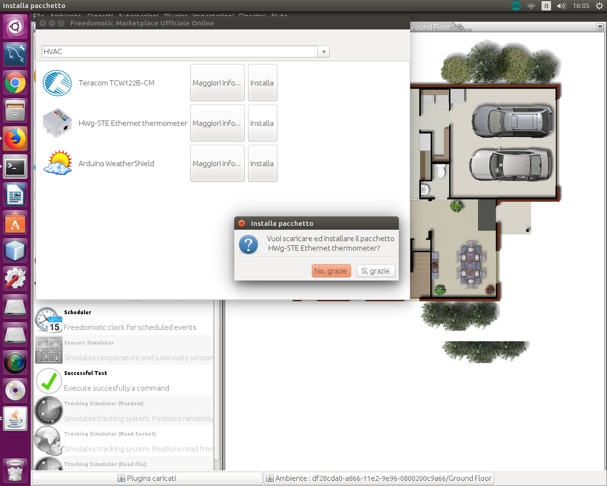
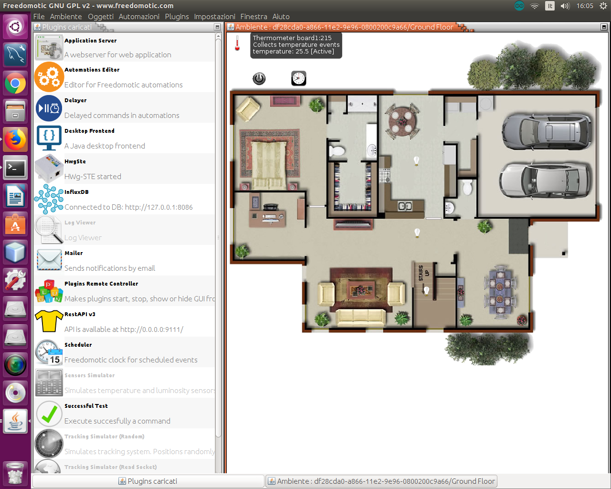
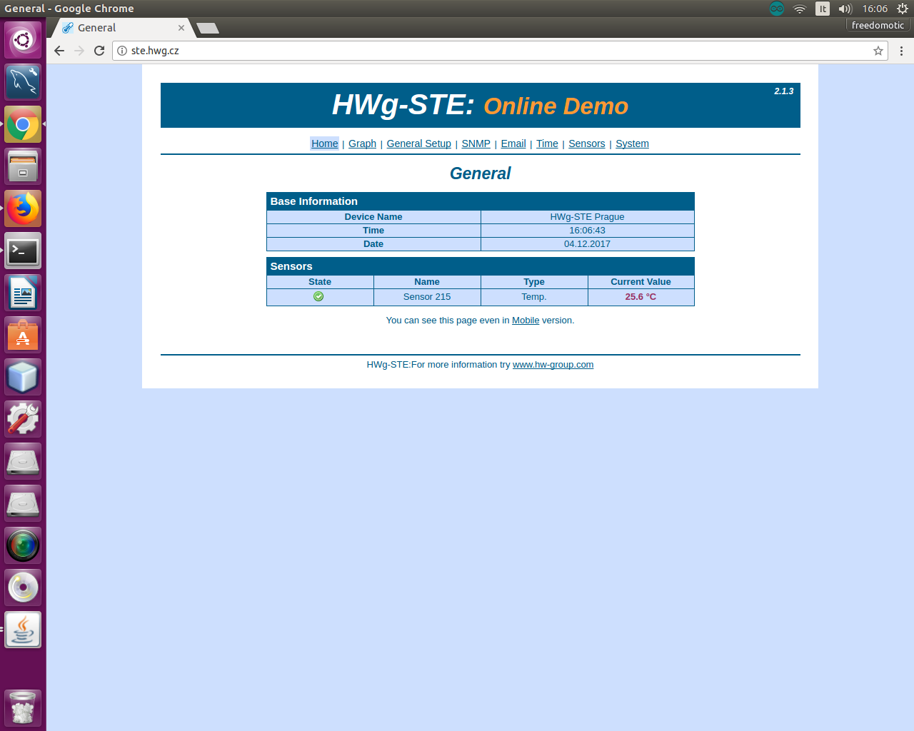
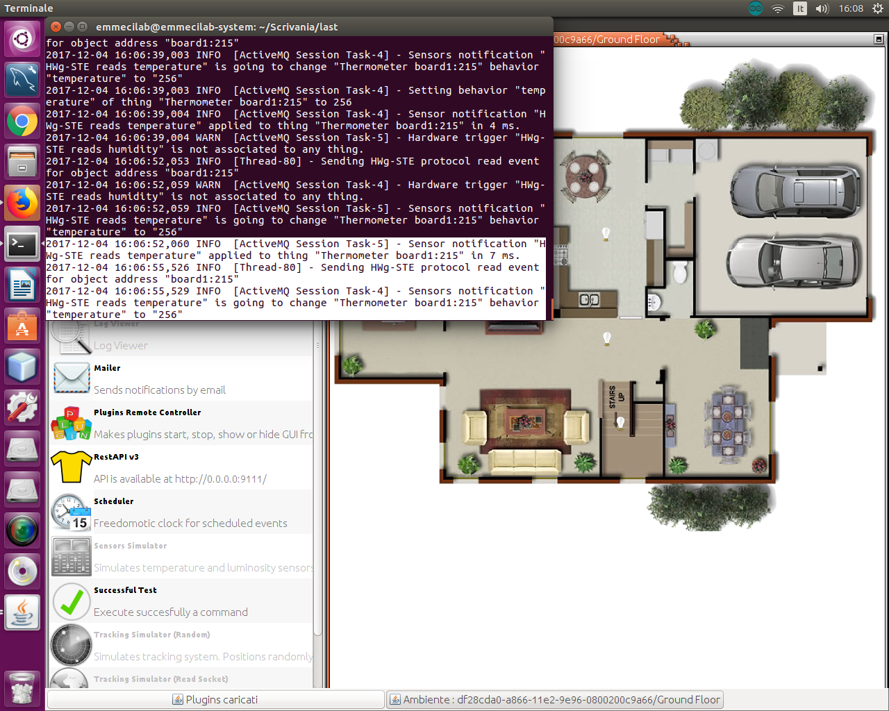

HWg-STE Ethernet thermometer
============================

**Description**: This plugin reads values from an ethernet thermometer by HW-group.com

**Type:** Driver - **Categories:** HVAC

**Development status:** Stable Release

**Tested on:** All platforms

**Developer:** Mauro Cicolella

Overview
--------
This plugin reads values from an ethernet thermometer by HW-group.com. You can connect up to two sensors of temperature and humidity. Indoor/outdoor sensors are available. Even temperature sensor with flat cable for temperature monitoring in the fridges. More details at http://www.hw-group.com/products/HWg-STE/STE_ip_temperature_sensor_en.html

It works sending periodically **SNMP** (Simple Network Management Protocol) request to the device using the **OID** (Object Identifier) specified by the manufacturer (http://ste.hwg.cz/HWg-STE_OID.txt).

    HWg-STE plugin download 

Configuration
-------------

All the configuration parameters are included in the *hwgste-manifest.xml* file. You can use it without any changes.

Each thermometer data are included in a ``<tuple></tuple>`` block where you need to specify:

* an 'alias' to identify the device 
* ip address of the device
* port of the device
* number of sensors (2 by default) 

How to read data from a sensor
------------------------------

Automatic setting
#################

By default the auto configuration feature is enabled (``<property name="enable-autoconfiguration" value="true"/>``) so the plugin
is able to add a configured thing on the map.

The type of thing is based on the unit read from the sensor: Thermometer for 'C'. 'F' or 'K'; Barometer for '%'.  

Manual setting
##############

First of all you have to set this property ``<property name="enable-autoconfiguration" value="false"/>`` to disable auto configuration.

Add a **Thermometer** thing to your Freedomotic environment and then:

* Right click on the **Thermometer** in the environment to show its configuration panel
* Change the property **protocol** to **hwgste**
* Change the property **address** to a string composed of **ALIAS:SENSOR-ID**  where **ALIAS** is the alias used to identify your device and **SENSOR-ID** is its id. An example address can be **board1:215**. 
* Under **temperature** (in **Data Sources**) select from the list ``HWg-STE reads temperature``.

The same procedure is required for **humidity**. In this case you have to add a **Barometer** thing to the map, set **address** and **protocol** as described previously 
and assign the trigger  ``HWg-STE reads humidity`` to **humidity** behavior.

    Thermometer reads data from a sensor
    

    HWg-STE online demo
    
    

    HWg-STE plugin data log
    
Download
--------
`Download plugin latest version <https://bintray.com/freedomotic/freedomotic-plugins/download_file?file_path=hwg-ste-5.6.x-3.0_0.device>`_

Source code
-----------
`GitHub repository <https://github.com/freedomotic/freedomotic/tree/master/plugins/devices/hwg-ste>`_
