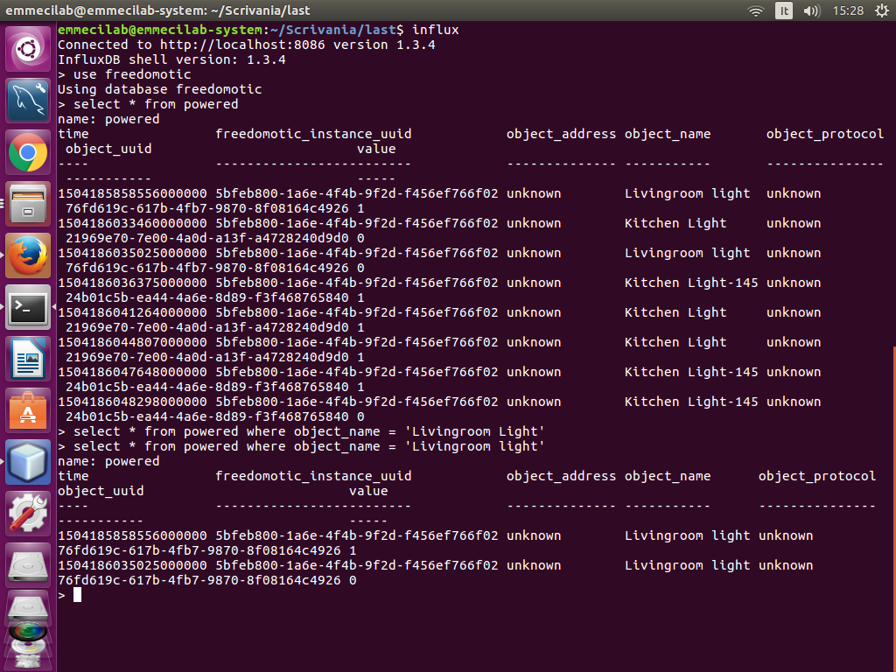

InfluxDB Persistence
====================

**Description**: Time series persistence on InfluxDB

**Type:** Driver - **Categories:** Utilities 

**Development status:** Prototype

**Tested on:** All platforms

**Developer:** Mauro Cicolella

Overview
--------
This plugin is intended to store data into an InfluxDB database.
It collects all things behaviors and values in the form of time series so data can be 
analyzed and used to create charts.

Configuration
-------------
First of all you need a running instance of InfluxDB and you have to set the connection parameters
into the manifest file.
If the authentication is enabled username and password are required.
in the *influxbd-persistence-manifest.xml* file.
If the authentication is enabled on the database, username and password are required.

By default the database name is "freedomotic" but you can change it.

.. csv-table::
   :header: "Parameter", "Description", "Default value"
   :widths: 15, 30, 30

   "db-url", "database url", "http://127.0.0.1:8086/"
   "db-name","database name", "freedomotic"
   "username", "username to access the database", "root"
   "password", "password to access the database", "root"
   "retention-policy", "data retention policy", "autogen"
  
Database structure
------------------
This plugin saves data about Freedomotic things' behaviors "only" when the measurement changes
For example you could have a single stored datapoint if the temperature is constant for an hour or multiple datapoints
if it changes.

The database has the following structure:

.. csv-table::
   :header: "Name", "Description", "Type"
   :widths: 15, 30, 30

   "time", "timestamp of measurement - autogenerated", "timestamp"
   "freedomotic_instance_uuid", "UUID of Freedomotic instance", "field"
   "object_name", "name of the object", "field"
   "object_protocol", "protocol of the object", "field"
   "object_address", "address of the object", "field"
   "object_uuid", "uuid of rhe object", "field"
   "value", "measurement value", "measurement"

    InfluxDB data     
    
    
You can use these fields to create complex queries.

How to save data
----------------

In order to save data you need to create a specific automation.
In Jfrontend go to Automations -> Manage Automations and select one of the following triggers:

* ``When a temperature has changed`` (detects any change about temperature)
* ``When an electric device behavior has changed`` (detects any change - on/off - about electric devices)
* ``When a generic sensor behavior has changed`` (detects any change about sensors

and write in the Command text field ``Save data on InfluxDB``. Confirm and press OK button.

