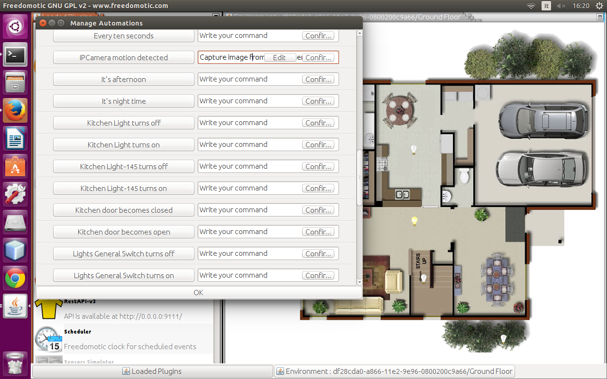

IpCamera Motion Plugin
======================

**Description**: This plugin detecs motion in MPEG streams

**Type:** Driver - **Categories:** Media, Utilities 

**Development status:** Prototype 

**Tested on:** All platforms

**Developer:** Mauro Cicolella

Overview
--------

Configuration
-------------
* Open the *camera.xml* file and set a name for the camera and the url to access to the stream in your browser (take a look at the examples).

.. figure:: images/ipcamera-motion-plugin.png
    :width: 600px
    :align: center
    :height: 400px
    :alt: IPCamera Motion Plugin
    :figclass: align-center

    IPCamera Motion Plugin 
    
    

* Double click on the plugin icon to start it. Then right click on the same icon and on **Configure IPCamera plugin** to open the GUI and see all the images from the cameras. 

.. figure:: images/ipcamera-motion-gui.png
    :width: 600px
    :align: center
    :height: 400px
    :alt: IPCamera Motion Plugin GUI
    :figclass: align-center

    IPCamera Motion Plugin GUI

How to save a captured image
----------------------------
It's possible to save an image when motion is detected by a camera. The default folder is **FREEDOMOTIC_ROOT\plugins\devices\ipcamera-motion\data\captured-images**.

* Open **Manage Automations** (F7 key) and search the trigger "**IpCamera motion detected**". In the command field write "**Capture image from an IpCamera**". Press the **Confirm** button and then **OK** at the bottom of the window.

    IPCamera Motion Plugin Automations 

Now for every notified event a message will appear on the map and a snapshot of the camera will be saved in a file named as the following format
*name-webcam\_date\_hour.jpg*.
