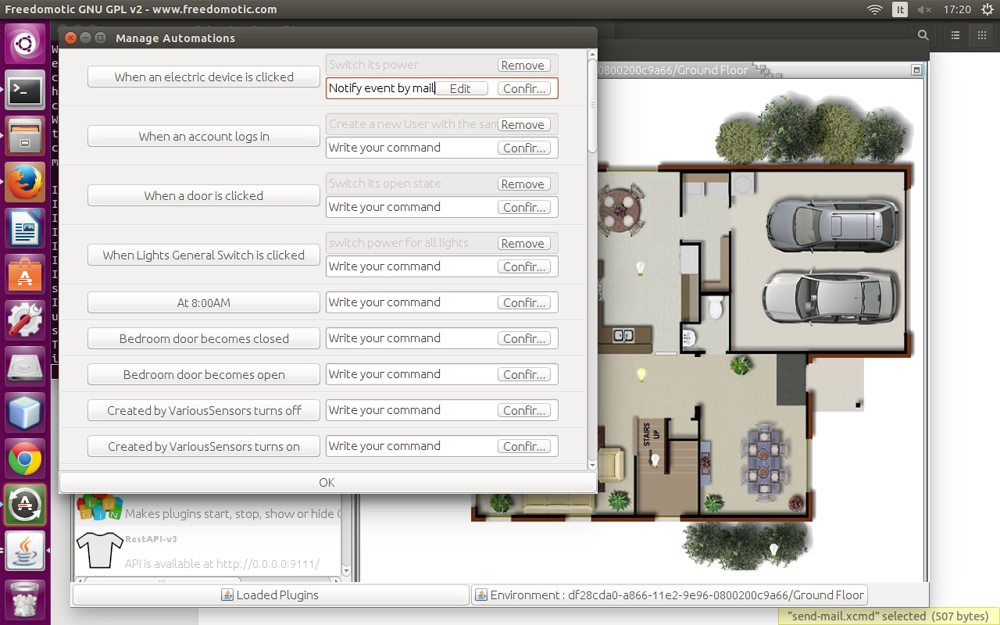

Mailer
======

**Description**: This plugin sends notification by email 

**Type:** Driver - **Categories:** Network & Communication, Utilities

**Development status:** Stable version

**Tested on:** All platforms

**Developer:** Enrico Nicoletti

.. note:: From 5.6.0 version it's included in the package distribution

Overview
--------

Configuration
-------------

- You need a Gmail account
- Set your Google username and password in the manifest file or if you are using **Jfrontend** click on menu **Plugins** -> **Configure** -> **Mailer**. Change only  'username' and 'password'.
- Save the changes
 
 
.. csv-table:: Configuration parameters
   :header: "Property", "Description", "Values"
   :widths: 15, 40, 40

   

Create an automation example
----------------------------

- Right click on a thing
- Switch to **Automations** tab in **Jfrontend**
- In the command field corresponding to the trigger ``when OBJECT_NAME object is clicked`` write ``Notify this event by mail``
- Save changes by pressing **Confirm** and **OK** button.   

    Mailer automations

When you click on this thing you should receive an email with the description of what happened.
 
Others plugins can use the mailer to send custom messages.

Send a mail notification with no attachment
~~~~~~~~~~~~~~~~~~~~~~~~~~~~~~~~~~~~~~~~~~~

.. code:: xml

 <command>
    <name>Notify event by mail</name>
    <receiver>app.actuators.messaging.mail.in</receiver>
    <description>send a mail</description>
    <hardwareLevel>false</hardwareLevel>
    <delay>0</delay>
    <timeout>0</timeout>
    <editable>false</editable>
    <properties>
        <properties>
            <property name="subject" value="A notification from your home"/>
            <property name="message" value="Event notified: thing @current.object.name clicked"/>
            <property name="attachment" value="no-attachment"/>
        </properties>
    </properties>
 </command>

Send a mail notification with attachment
~~~~~~~~~~~~~~~~~~~~~~~~~~~~~~~~~~~~~~~~

.. code:: xml

 <command>
    <name>Notify event by mail with attachment</name>
    <receiver>app.actuators.messaging.mail.in</receiver>
    <description>send a mail</description>
    <hardwareLevel>false</hardwareLevel>
    <delay>0</delay>
    <timeout>0</timeout>
    <editable>false</editable>
    <properties>
        <properties>
            <property name="subject" value="A notification from your home"/>
            <property name="message" value="Event notified: thing @event.description"/>
            <property name="attachment" value="/home/mauro/Desktop/fd/plugins/devices/mailer/data/cmd/index.txt"/>
        </properties>
    </properties>
 </command>

Command parameters
------------------

.. csv-table:: 
   :header: "Property", "Description", "Values"
   :widths: 15, 40, 40

   "name", "command name", "any string"
   "subject", "mail subject", "any string"
   "message", "mail text", "any string"
   "attachment", "absolute path of attachment", "path string (can't be empty)"

Notes
-----

Be aware that your firewall can block the sending of the email. Check the firewall settings.

Also, if needed, go to https://www.google.com/settings/security/lesssecureapps and enable "**the less secure apps**" option.
