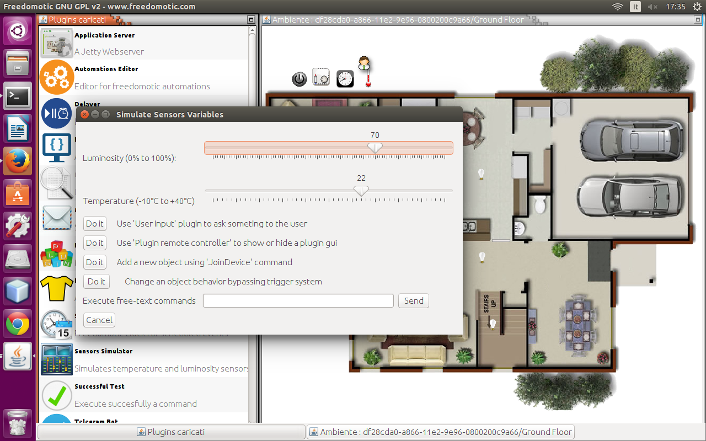
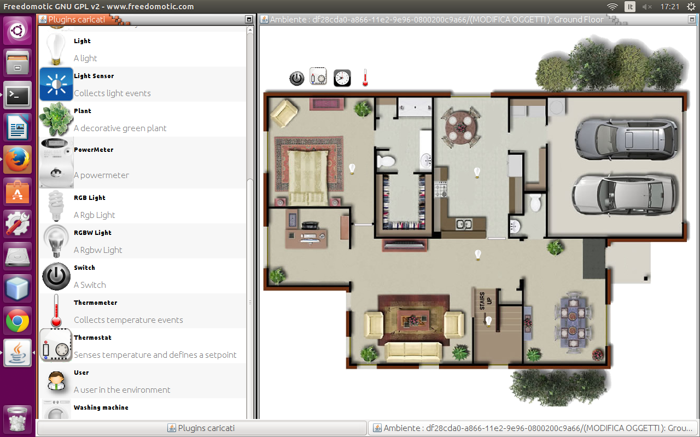

Sensors and tracking simulation
===============================

**Description**: A must have set of basic plugins like a clock to enable timed automations, automations editing and a set of sensors and tracking simulators, performance trackers, log viewer for both developers and users

**Type:** Driver - **Categories:** Utilities 

**Development status:** Stable Release

**Tested on:** All platforms

**Developer:** Enrico Nicoletti

.. note:: This plugin is included in the package distribution

Sensors simulator
-----------------

With this plugin you can 

* simulate luminosity or temperature changing
* ask user something
* add a new object using JoinDevice command
* execute free-text commands (e.g. write "turn on all lights")

    Sensors simulation 

Tracking simulation
-------------------
You can simulate user's movements inside your environment.
First of all add an "user" thing to the map.

    Add an user to the map 

Tracking simulator (Random)
~~~~~~~~~~~~~~~~~~~~~~~~~~~

Each user thing on the map is moved to a random position with a time interval specified by the ``sleep-time`` property.

.. csv-table:: Configuration parameters
   :header: "Property", "Description", "Values"
   :widths: 15, 40, 40

   "sleep-time","","2000"   
   

Tracking simulator (Read file)
~~~~~~~~~~~~~~~~~~~~~~~~~~~~~~

This plugin reads user's positions from a file.

This file, located under *FREEDOMOTIC_ROOT/plugins/devices/simulation/data/motes*, has *.mote* extension and its name must reflect the user thing one (e.g. if the user is named *admin* the tracking file must be *admin.mote*. 

We have two options for the positions: **coordinates** or **room/zone** names.

In the first case the *.mote* file has the following data format [x coord, y coord, time in ms].

.. code::

   300,250,2000
   450,390,5000

Alternatively you can use the format [room name, time in ms].

.. code::

   Kitchen,2000
   Bedroom,5000
   House,3000

.. figure:: images/simulation/tracking-simulator3.png
    :width: 600px
    :align: center
    :height: 400px
    :alt: Mote file example (room/zone format)
    :figclass: align-center

    Mote file example (room/zone format)

In every case each row represents a different movement.

.. figure:: images/simulation/tracking-simulator4.png
    :width: 600px
    :align: center
    :height: 400px
    :alt: Tracking log
    :figclass: align-center

    Tracking log 

In the previous example the user thing is moved to the Kitchen where it stays for 2 seconds then goes to the Bedroom and after 5 seconds to the House.
The last zone House doesn't exist so it's skipped. 

.. csv-table:: Configuration parameters
   :header: "Property", "Description", "Values"
   :widths: 15, 40, 40

   "data-type","data format in the .mote file","coordinates | rooms"
   "iterations","how many times the movements sequence must be executed","any integer > 0"

Tracking simulator (Read socket)
~~~~~~~~~~~~~~~~~~~~~~~~~~~~~~~~

.. csv-table:: Configuration parameters
   :header: "Property", "Description", "Values"
   :widths: 15, 40, 40

   "socket-server-port","","7777"
   "sleep-time","","1000"
   "max-connections","","any integer > 0 or -1 no limits"
   "stop-connection-char","","."

