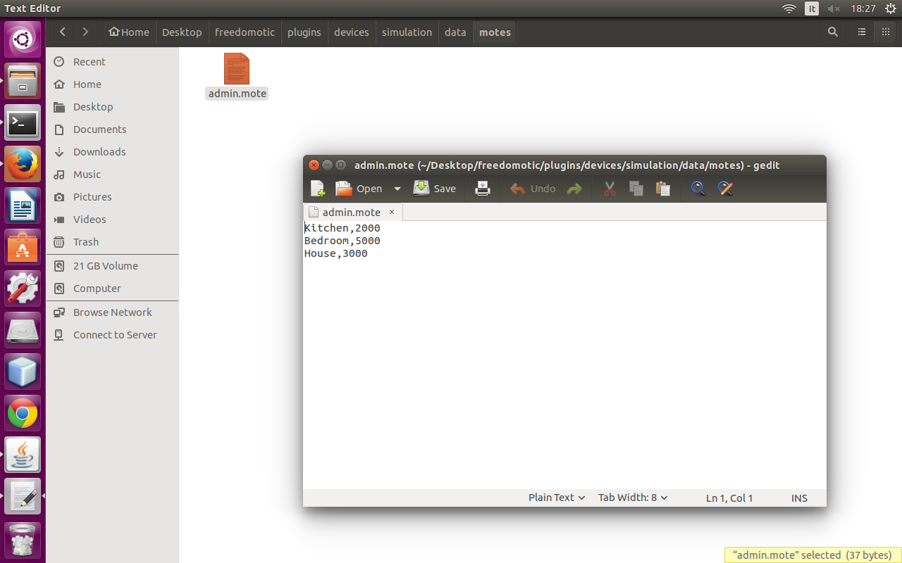
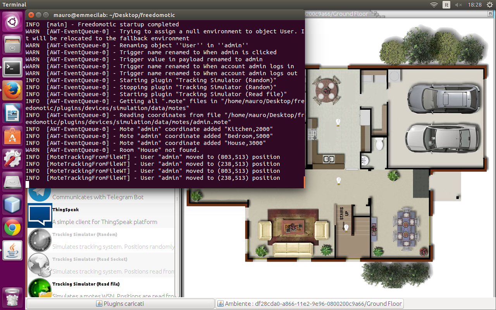

Sensors simulation
==================

**Description**: A must have set of basic plugins like a clock to enable timed automations, automations editing and a set of sensors and tracking simulators, performance trackers, log viewer for both developers and users

**Type:** Driver - **Categories:** Utilities 

**Development status:** Stable Release

**Tested on:** All platforms

**Developer:** Enrico Nicoletti

Sensors simulation
------------------

Tracking simulator random
-------------------------

.. csv-table:: Configuration parameters
   :header: "Property", "Description", "Values"
   :widths: 15, 40, 40

   "sleep-time","","2000"   
   

Tracking simulator read file
----------------------------
This plugin reads user's positions from a file.

This file, located under *FREEDOMOTIC_ROOT/plugins/devices/simulation/data/motes* has *.mote* extension and its name must reflect the user thing one (e.g. if the user is named *admin* the tracking file must be *admin.mote*. 

We have two options for the positions: coordinates or room/zone names.

In the second case the *.mote* file has the following structure [room name, time in ms]

.. code::

   Kitchen,2000
   Bedroom,5000
   House,3000

    Mote file example 

    Tracking log 

In the previous example the user thing is moved to the Kitchen where it stays for 2 seconds then goes to the Bedroom and after 5 seconds to house.
The last zone House doesn't exist so it's skipped. 

.. csv-table:: Configuration parameters
   :header: "Property", "Description", "Values"
   :widths: 15, 40, 40

   "data-type","","coordinates | rooms"
   "iterations","",2"

Tracking simulator read socket
------------------------------

.. csv-table:: Configuration parameters
   :header: "Property", "Description", "Values"
   :widths: 15, 40, 40

   "socket-server-port","","7777"
   "sleep-time","","1000"
   "max-connections","","integer greater than 0 | -1 no limits"
   "stop-connection-char","","."

