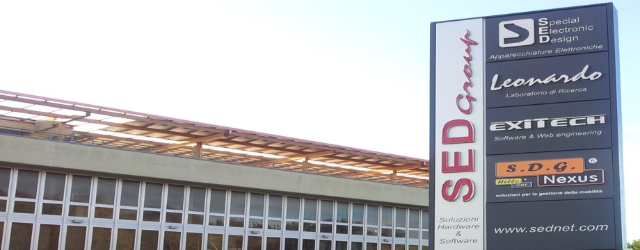

SED Special Electronic Design
=============================

[SED](http://www.sednet.com/) Limited society environment management

#. Remote access
#. Automations aimed at limited consumption
#. Device automation override
#. Granular user privileges
#. Verification of consumption of variable temporal arc
#. Hierarchical control between buildings
#. Hardware/plant

    
    Special Electronic Design

The electrical system globally exploits the use of contactors in bistable relay for the control of devices that are not natively provided for a home automation system. The home automation control adapters have been added at a later stage and positioned in parallel to a pre-existing plant, in order to read the status of the devices and control the contactors. In this perspective, it wanted to show that it is possible to 'extend' a classic system with home automation controls, also to limit the planned set of activities and allow for retrofitting low costs.
The Easybox cards are therefore used to add a classic on the system advanced features, including:

#. Timing the ignition of the fan coil, in order to ensure the homogeneous air conditioning of the rooms.
#. Timing the turning off of devices, in order to minimise the wastage from forgetfulness.
#. Collect data on the use of the devices, in order to estimate the fuel consumption and the resulting savings, compared to the scenario of a classic system.

Software/Plugins
----------------

The system is run on a workstation WIN 7 Intel Core i3 and 4GB RAM; The same machine also houses a SQLSERVER 2008 server.

Plugins used for the current system
-----------------------------------

#. Easybox boards control
#. Harvester: Storage of usage data on db.
#. Twilight: Events based on sunrise and sunset time.
#. Chat: Remote control, test control and automation.
#. Desktop Frontend
