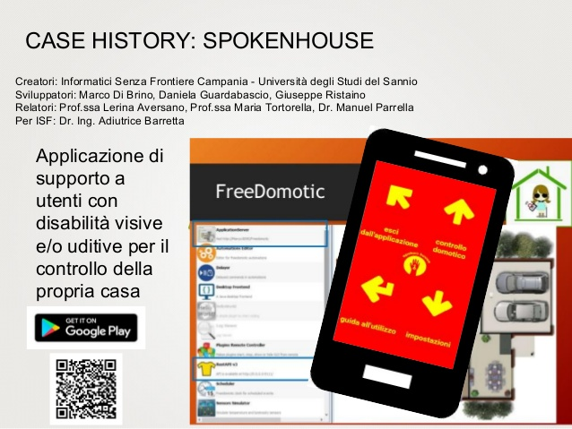

Spoken House
============

**Spoken House** is a mobile app for users with impaired vision and / or hearing, developed in collaboration between Informatici senza Frontiere and the University of Sannio. 

Its interface to 4 corners, along with an electronic voice guidance, allows easy use and an easy navigation within the application.

    
    Spoken House

Features
--------

* Interface divided into 4 equal parts, each corresponding to a corner of the device
* Increase or decrease the font size of text displayed
* Change the default theme with other combinations of colors, high contrast
* Activate the electronic voice as an aid to navigation
* Activate encoding messages in Morse code through the vibration
* Activate encoding messages marked in Italian
* View the video application help in sign language
* Activate voice control to change the state of objects in the house.

Requirements
------------

* Freedomotic 5.6.0-rc3

In order to properly connect the smartphone to Freedomotic, during the first access to the application you are required parameters:

* ip address of the machine running Freedomotic
* username and password used to access Freedomotic

The latest addition to Spoken House is the voice control! After activating this mode in the settings, by pressing any hardware button volume control, you will be sent a voice command application to handle more comfortably objects in the framework. This mode allows for the moment only the on / off or opening / closing of some objects. The typical sentence structure recognized by the application requires a verb as the first word (eg "open" or "turn on") and then the name of the object to be controlled, as well as the name of the room and the floor where is located (complete example: Open the door of the living room of the first floor).
It is cross platform mobile application that allows people with visual impairments easier management of devices in your home through their home automation control.

Resources
---------

* `Android App <https://play.google.com/store/apps/details?id=org.informaticisenzafrontiere.spokenHouse&hl=it>`_

* Presentation on Prezi.com http://prezi.com/7pkirffztvwb/?utm_campaign=share&utm_medium=copy

* :doc:`Slides and complete thesis <../who-is-using-freedomotic/academic-papers>`

*A great thanks to the neo engineers Marco Di Brino, Daniela Guardabascio, Giuseppe Ristaino, the faculty Prof. Lerina Aversano and Prof. Maria Tortorella and the representatives of Informatici Senza Frontiere  Dr. Manuel Parrella and Ing. Adia Barretta.*