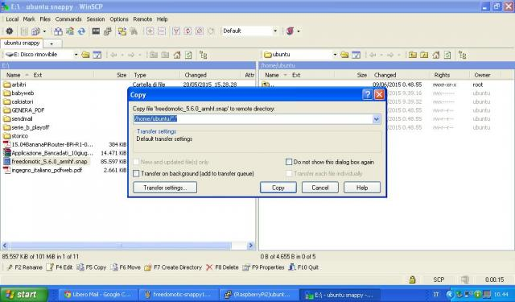
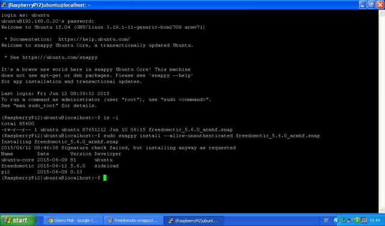
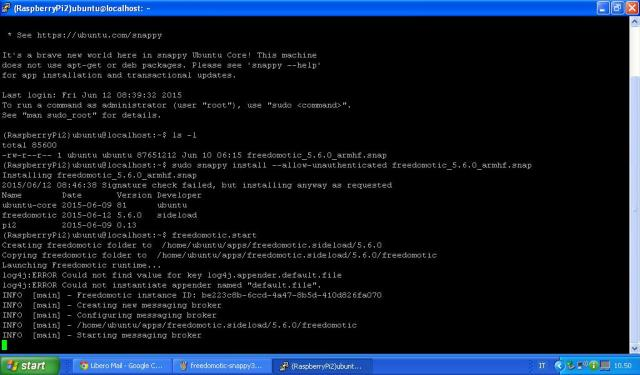

Ubuntu Snappy
=============

Freedomotic porting on Ubuntu Snappy. Repository on GitHub

Setting a Snappy development system
###################################

#. Download Ubuntu 15.04
#. Install snappy cli with ``sudo apt-get install ubuntu-snappy-cli``
#. Snappy checks your app configuration so you need to install review tools. For 15.04: https://launchpad.net/~snappy-dev/+archive/ubuntu/tools/+files/click-reviewers-tools_0.26_all.deb

Prepare your snap package
#########################

#. ``git clone https://github.com/freedomotic/fd-snappy.git``
#. ``cd fd-snappy``
#. Download Oracle Java 7 for ARM from http://archive.raspberrypi.org/debian/pool/main/o/oracle-java7-jdk/oracle-java7-jdk_1.7.0+update40_armhf.deb
#. Extract the archive and copy the content of jre folder (bin & lib) into *fd-snappy/jre* folder
#. Download the last available Freedomotic build from here and extract it into *fd-snappy/freedomotic*
#. ``sudo snappy build .``

.. figure:: images/ubuntu-snappy1.jpg
    :width: 600px
    :align: center
    :height: 400px
    :alt: Ubuntu Snappy
    :figclass: align-center

Upload & install the snap to your snappy device
###############################################

You have two options:

**from your development system**

Determine the ip address of your snappy device with ifconfig then digit

.. code-block:: guess
   
   snappy-remote --url=ssh://<ip-of-your-snappy-core-device> install ./freedomotic_5.6.0_armhf.snap

    
     

**from local**

Upload the app to your snappy device by ssh (using SCP)

    Upload the app to your device by ssh (using SCP)

then digit in console

.. code-block:: guess

   sudo snappy install --allow-unauthenticated freedomotic_5.6.0_armhf.snap

Run Freedomotic
###############
From command line digit

.. code-block:: guess 

   freedomotic.start

    

Point your browser to http://ip-of-your-snappy-core-device:9111 and play with our API

Tested Boards
#############

- Raspberry Pi2
